<div align="center">


&nbsp;&nbsp;&nbsp;


# Steam Trader

**Upload once, get daily emails, we watch your idle inventory**

[](#tech-stack)
[](#tech-stack)
[](#)

Upload trade history · Enter your email · Receive daily market reports automatically

</div>

> 🌐 **Language / 語言**: English | [繁體中文](readme.md) | [简体中文](readme_zhCN.md)

---

## What Is This?

The Steam Community Market is essentially a massive virtual second-hand marketplace. Players naturally accumulate skins, cases, and stickers through gaming — some are in use, others sit idle in the inventory, potentially at a great selling price.

**Steam Trader is not a quantitative trading system, nor does it intend to be.** Think of it as your personal item butler: it remembers what you paid for each item, tells you what it's worth now, and whether you'd make enough profit after fees for a cup of coffee. That's it.

> *A flea market seller needs a tool that alerts when prices go up, not a Wall Street trading terminal.*

<div align="center">
<table><tr>
<td>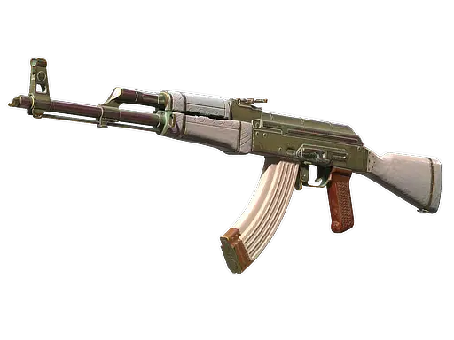</td>
<td>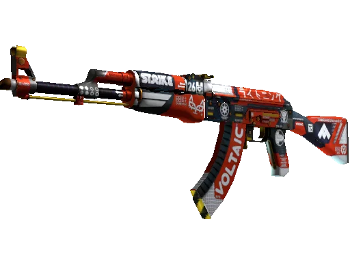</td>
<td>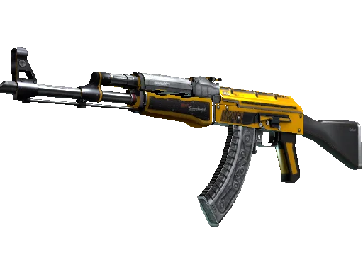</td>
<td>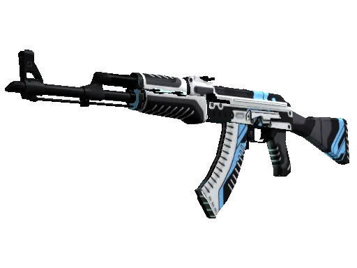</td>
<td>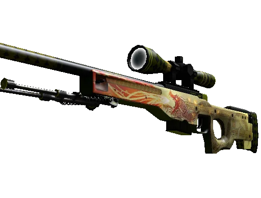</td>
<td>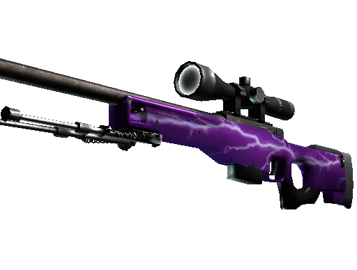</td>
<td></td>
<td>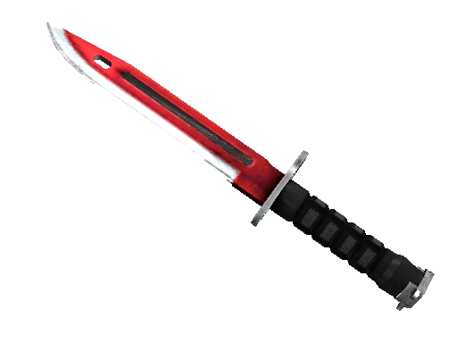</td>
<td>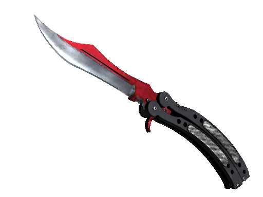</td>
<td>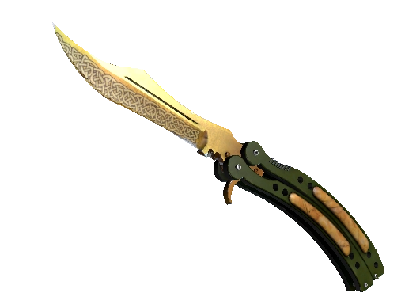</td>
</tr><tr>
<td>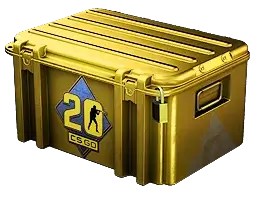</td>
<td></td>
<td>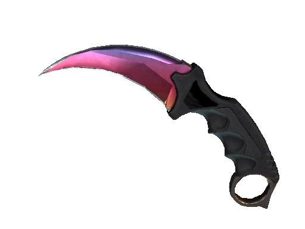</td>
<td>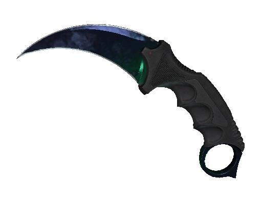</td>
<td>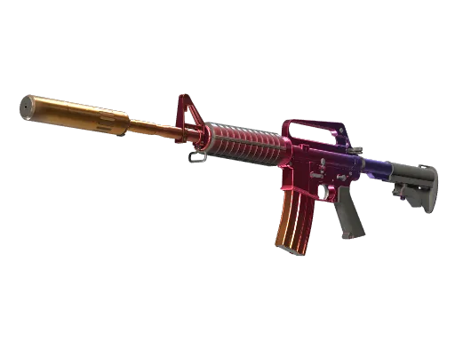</td>
<td>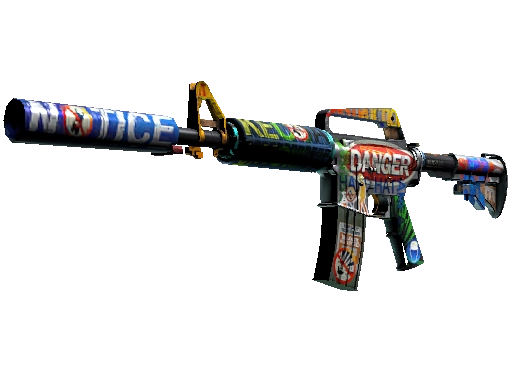</td>
<td>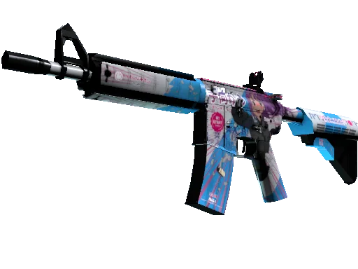</td>
<td></td>
<td>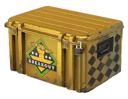</td>
<td></td>
</tr><tr>
<td>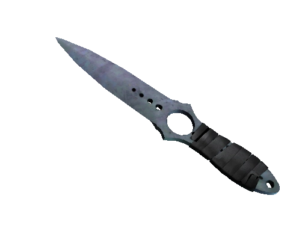</td>
<td>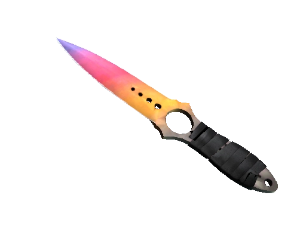</td>
<td>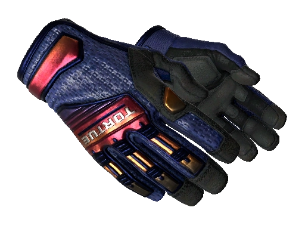</td>
<td>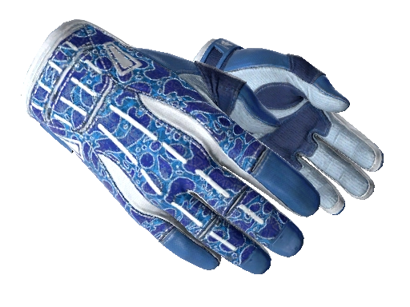</td>
<td></td>
<td></td>
<td></td>
<td></td>
<td></td>
<td></td>
</tr></table>
</div>

### How It Works

The entire product is **one page** and **one email**:

<div align="center">
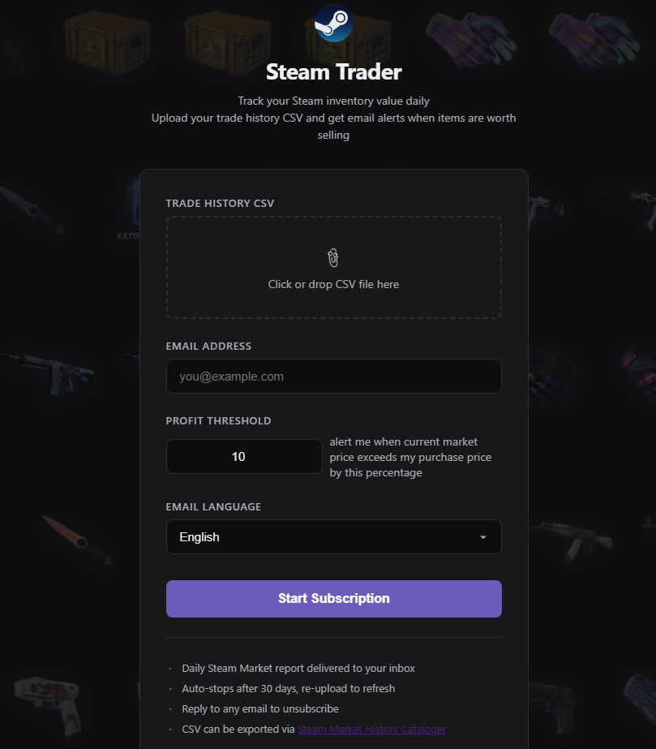
</div>

User uploads CSV + enters email → System fetches market prices daily, generates static HTML email reports. **No login, no account registration, no need to keep a tab open.**

### Core Features

| Feature | Description |
|---------|-------------|
| **Single-page upload** | The only frontend: upload CSV, enter email, set threshold, submit and go |
| **Daily email push** | System auto-fetches market data, generates static HTML report and emails it |
| **Sell recommendations** | Filters items with profit above threshold (after Steam's 12% fee) |
| **30-day cycle** | Subscription auto-expires after 30 days; re-upload CSV to refresh |
| **One-click unsubscribe** | Reply to any email to cancel |

### Email Report Preview

Each push is a static HTML email containing:

```
━━━━━━━━━━━━━━━━━━━━━━━━━━━━━━━━━━━━━━
  Steam Trader · Daily Market Report
  2026-04-15 · Day 12/30
━━━━━━━━━━━━━━━━━━━━━━━━━━━━━━━━━━━━━━

  📊 Portfolio Overview
  ───────────────────────────
  Items held: 23
  Estimated value: ¥ 3,450.00
  Worth selling: 5

  🔥 Sell Recommendations (profit ≥ 10%)
  ┌──────────────────┬────────┬────────┬───────┐
  │ Item             │ Bought │ Current│ Profit│
  ├──────────────────┼────────┼────────┼───────┤
  │ AK-47 | Redline  │ ¥40.00 │ ¥52.00 │+14.3% │
  │ AWP | Asiimov    │ ¥150.00│ ¥188.00│+10.2% │
  └──────────────────┴────────┴────────┴───────┘

  📦 Full Holdings
  (Complete item list with current prices)

  ──────────────────────────────────────
  Reply to this email to unsubscribe
  Remaining push days: 18
━━━━━━━━━━━━━━━━━━━━━━━━━━━━━━━━━━━━━━
```

### Supported Games

The system identifies games by AppID in the CSV — **supports all games with a Steam Community Market**, including but not limited to:

| AppID | Game |
|------:|------|
| `730` | Counter-Strike 2 |
| `570` | Dota 2 |
| `440` | Team Fortress 2 |
| `578080` | PUBG: BATTLEGROUNDS |
| `252490` | Rust |
| `...` | And any other game with a Community Market |

---

## Tech Stack

```
┌──────────────────────────────────────────────────────────┐
│              Frontend (Single Page)                       │
│   HTML / CSS · Vanilla JS or Alpine.js                   │
│   Features: CSV upload + Email input + Threshold config  │
├──────────────────────────────────────────────────────────┤
│              Backend (Flask 3.x)                         │
│   /upload    Receive CSV + Email                         │
│   /unsubscribe  Handle unsubscription                    │
├──────────────────────────────┬───────────────────────────┤
│  Data Layer                  │  Scheduler                │
│  pandas · requests · BS4     │  APScheduler              │
│  (Market data + profit calc) │  (Daily email push cron)  │
├──────────────────────────────┴───────────────────────────┤
│  Email                       │  Storage                  │
│  Flask-Mail / SMTP           │  SQLite                   │
│  Jinja2 HTML template render │  (Subs · Items · Cache)   │
└──────────────────────────────────────────────────────────┘
```

<details>
<summary><b>Dependency Details</b></summary>

| Module | Tech | Role |
|--------|------|------|
| Backend framework | Flask 3.x | Routing, file upload, template rendering |
| Frontend | HTML / CSS / Alpine.js | Single-page upload form (no build tools) |
| Scheduler | APScheduler | Daily cron to iterate active subs and trigger push |
| Email sending | Flask-Mail / smtplib | SMTP delivery, HTML email rendering |
| Email templates | Jinja2 | Static HTML report generation |
| Data processing | pandas | CSV parsing, profit calculation |
| Market data | requests / BeautifulSoup4 | Steam API calls, page parsing |
| Storage | SQLite | Subscription state, holdings, price cache |

</details>

---

## Workflow

```
 User Action (one-time)                 System (runs for 30 days)
─────────────────────                   ─────────────────────────
                                    
  Chrome Extension                       Daily Cron Job
  Export CSV                             ┌─────────────────┐
      │                                  │ Fetch prices     │
      ▼                                  │ Calculate profit │
  Open webpage                           │ Render HTML email│
  Upload CSV + Email ──▶ System ──▶     │ Push to inbox    │
      │                                  └────────┬────────┘
      ▼                                           │
  Close the page,                        Day 30 ──▶ Auto-stop
  you're done                            Reply email ──▶ Stop now
```

### Step 1 — Export Trade History

1. Install [Steam Market History Cataloger](https://chromewebstore.google.com/detail/steam-market-history-cata/dhpcikljplaooekklhbjohojbjbinega) in Chrome
2. Go to Steam Community Market → My Market History
3. The extension auto-loads all records
4. Click export as CSV

> [!NOTE]
> CSV column headers follow the user's Steam account language setting (e.g., Simplified Chinese accounts export Chinese headers, English accounts export English headers), but **column order and semantics are consistent**. The system parses by column position, not header names.

### Step 2 — Upload and Subscribe

Open the webpage, upload your CSV file, enter your email, set the profit threshold (default 10%), and submit. **Then you can close the page.**

**Field definitions (Simplified Chinese example):**

| # | Field | Meaning |
|:-:|-------|---------|
| 1 | 指数 | Record index |
| 2 | 信用 | `1` = Sell, `0` = Buy |
| 3 | 交易ID | Steam transaction ID |
| 4 | 应用程序ID | Game AppID |
| 5 | 名称 | Item name |
| 6 | 价钱 | Transaction amount |
| 7 | 上市 | Listing date |
| 8 | 采取行动 | Action date |
| 9 | 金额 | Quantity |

<details>
<summary><b>CSV Example</b></summary>

```csv
"指数","信用","交易ID","应用程序ID","名称","价钱","上市","采取行动","金额"
119,0,765178889458411703-765178889458411704,730,"印花 | donk（全息，冠军）| 2024年上海锦标赛","¥ 23.40",2025-14-12,2025-14-12,1
```

</details>

### Step 3 — Receive Daily Emails

You'll receive a static HTML market report email at a fixed time each day, containing:

- **Portfolio Overview** — Item count, estimated total value
- **Sell Recommendations** — Items above profit threshold (after fees)
- **Full Holdings** — Each item's purchase price vs current market price

### Subscription Lifecycle

| Event | Behavior |
|-------|----------|
| Upload CSV + Email | Create subscription, begin daily push |
| Day 30 | Auto-stop push |
| Reply to any push email | Cancel subscription immediately |
| Re-upload CSV | Refresh holdings, reset 30-day cycle |

---

## Core Modules

### Steam Market API — Price Fetching

The Steam Community Market provides public endpoints requiring no authentication:

```python
import requests

def get_steam_price(item_hash_name, appid=730):
    """
    Get Steam market item price
    appid=730 → CS2, currency=29 → HKD
    """
    url = "https://steamcommunity.com/market/priceoverview/"
    params = {
        "country": "HK",
        "currency": "29",
        "appid": appid,
        "market_hash_name": item_hash_name
    }

    response = requests.get(url, params=params)
    data = response.json()

    if data.get("success"):
        return {
            "lowest_price": data.get("lowest_price"),   # Lowest listing price
            "median_price": data.get("median_price"),   # Recent median sale price
            "volume": data.get("volume")                # 24h trade volume
        }
    return None
```

### Trade Analysis Engine

```python
import pandas as pd

class TradingAnalyzer:
    STEAM_FEE_RATE = 0.12  # Steam fee 12%

    def __init__(self, history_csv_path):
        self.history = pd.read_csv(history_csv_path)

    def calculate_profit_ratio(self, bought_price, current_price):
        """
        Profit ratio = (net proceeds - purchase cost) / purchase cost
        Net proceeds = current price × (1 - fee rate)
        """
        after_fee = current_price * (1 - self.STEAM_FEE_RATE)
        return (after_fee - bought_price) / bought_price

    def find_sell_opportunities(self, items, threshold=0.10):
        """Filter items with profit ratio ≥ threshold"""
        opportunities = []
        for item in items:
            current_price = get_steam_price(item['hash_name'])
            ratio = self.calculate_profit_ratio(
                item['bought_price'],
                current_price['lowest_price']
            )
            if ratio >= threshold:
                opportunities.append({
                    'item_name': item['name'],
                    'bought_price': item['bought_price'],
                    'current_price': current_price['lowest_price'],
                    'profit_ratio': f"{ratio * 100:.1f}%",
                    'after_fee_income': current_price['lowest_price'] * 0.88,
                    'listing_count': current_price.get('listing_count', 'N/A')
                })
        return opportunities
```

### Price History

```python
def get_price_history(item_hash_name, days=30):
    """Fetch recent N days of historical trade data"""
    url = "https://steamcommunity.com/market/pricehistory/"
    params = {"appid": 730, "market_hash_name": item_hash_name}

    response = requests.get(url, params=params)
    data = response.json()

    return [
        {'date': e[0], 'price': float(e[1]), 'volume': int(e[2])}
        for e in data['prices'][-days:]
    ]
```

---

## Data Field Mapping

| Field | Source | Description |
|-------|--------|-------------|
| Game name | CSV `AppID` mapping | Auto-detected |
| Item name | Steam API | `market_hash_name` |
| Quality / Wear | Market page parsing | Factory New → Battle-Scarred |
| Purchase price | CSV import | Historical transaction amount |
| Sell price | CSV import | Shown if sold |
| Listings | Market page parsing | Current active listings |
| Lowest listing | Steam API | `lowest_price` |
| Profit ratio | System calculated | `(market price × 0.88 − purchase price) ÷ purchase price` |
| Trend | Price history API | 30-day price trend |

---

<div align="center">
<sub>Built for fun, not for Wall Street.</sub>
</div>
